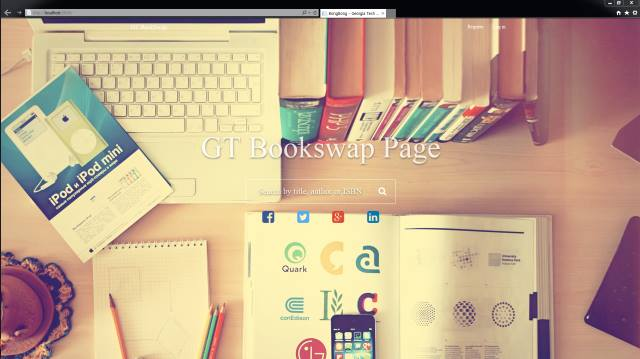
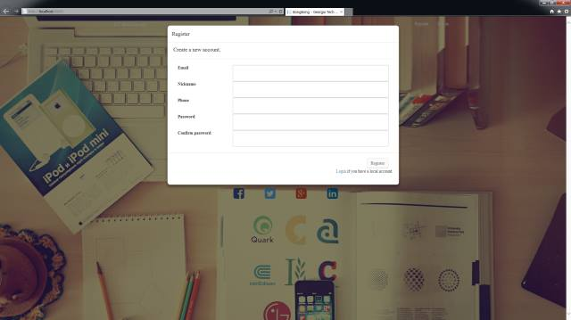
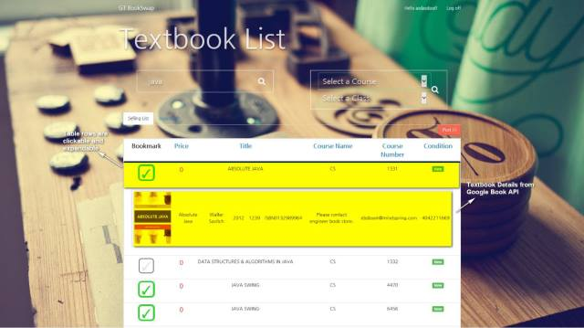
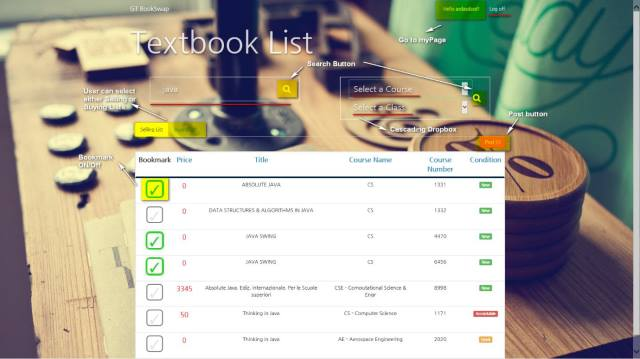
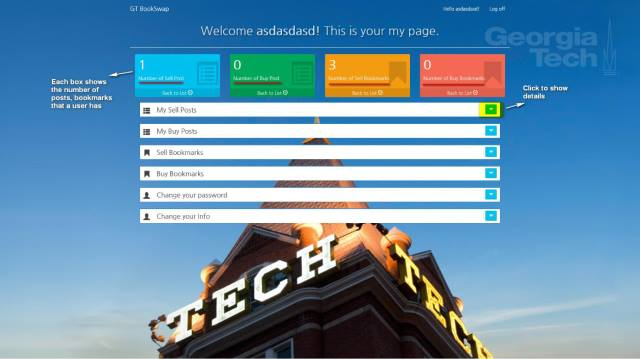

# BookSwap

BongBong is a website that allows users to exchange their used textbooks among Georgia Tech students. It provides quick search options, sorting posts by prioritizing them and suggesting a better communication between buyers and sellers.

This project is made for Senior Design Project (CS4911 course).

# Features
1. Main Page

* Search title, author, ISBN, course number, category for textbook

2. Register Modal

* Register to create user's info 

3. Search Page

* Search for title, author, ISBN for textbook
* Select Georgia Tech course and id to search textbook
* Retrieve the textbook information from Google Book API and Georgia Tech course number

* Select buying and selling list
* Post your book to buy or sell

4. MyPage

* Retrieve user's selling books, and buying books. 
* Retrieve user's bookmarks 
* user can change user's information

## Documentation
* Vision Documentation
CS4911_Team44_VisionDocumentation_Final.pdf

* Customer Deliver Documentation 
CS4911_Team44_Customer_Delivery_Document.pdf

* DB Relational Schema
CS4911_Team44_Data_Transfer_object_Relational_Schema_Final.pdf

